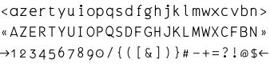
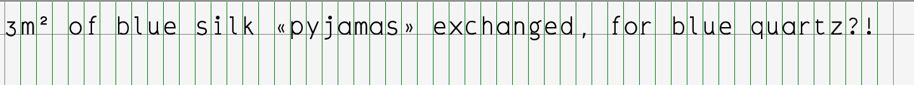
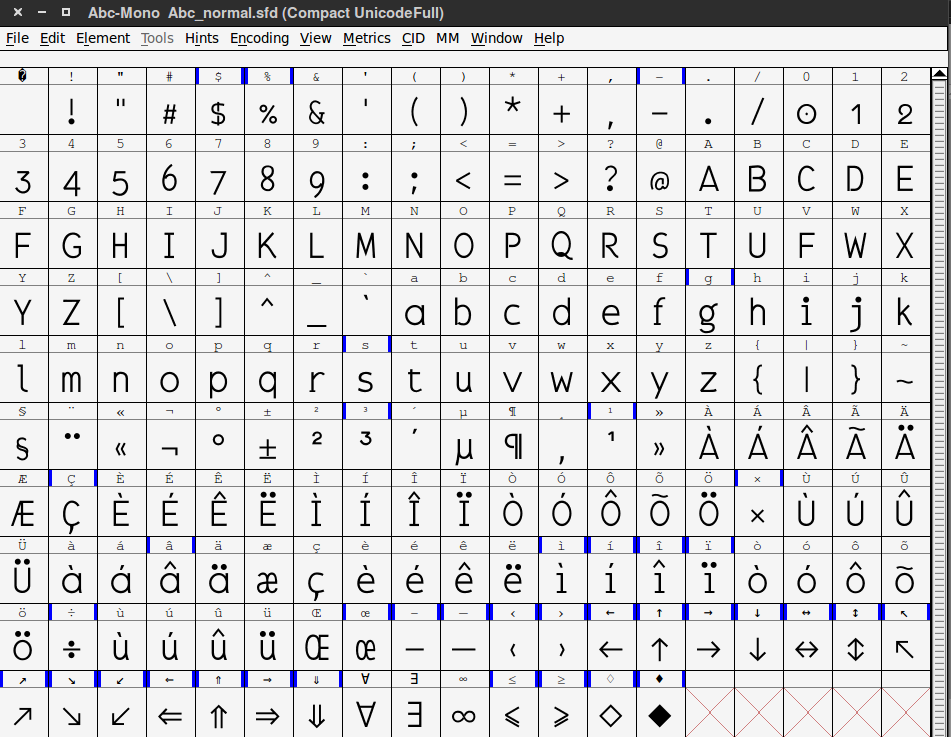

# Abc

Simple monospaced font.

# todo
* add arrows, geometric shapes, and some missing Latin glyphs.
* make the italic version, and the bold, extrabold, light versions.
* add ligatures (-> →, => ⇒, != ≠, >= ≥, <= ≤)
* find a better name.

# samples

<!---->

# download
[Abc-Mono.ttf](https://github.com/EliseDuverdier/font_abc/raw/master/Abc-Mono.ttf)
